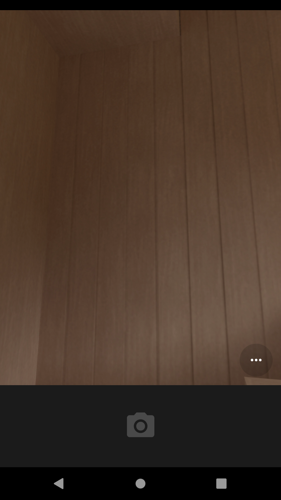
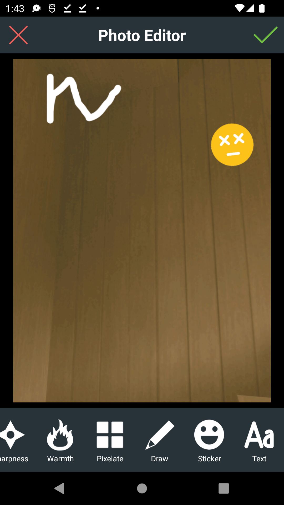

## Photo Editor App
- Android  application written with kotlin programming language.

 

 
- Build System: [Gradle](https://gradle.org)

 
## Prerequisite
- To run these application you need 
* Android Studio.
 

 

## TechStack 
 * Use content provider to save the image at specific location  when image capture from camera.
 * Implemented  DS photoeditor android SDK to edit the photo.
 * You can blur the image , add text , add Frame , and  a lot more features.
 * Use can use camera or gallery to edit you photo.
 

